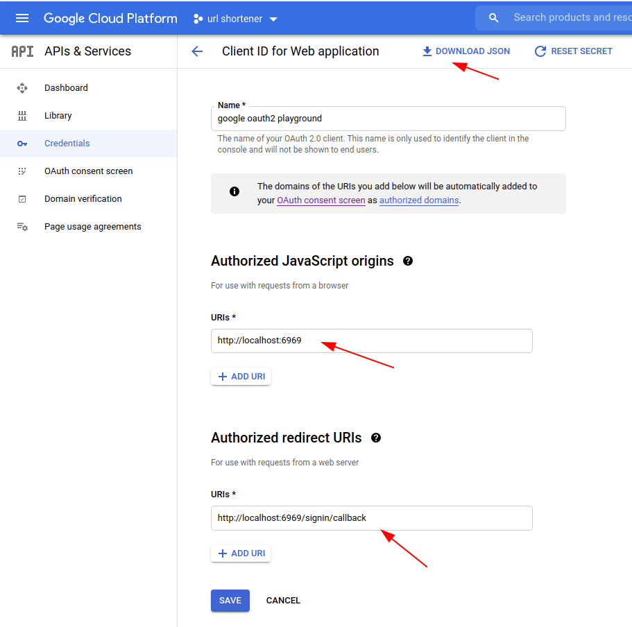
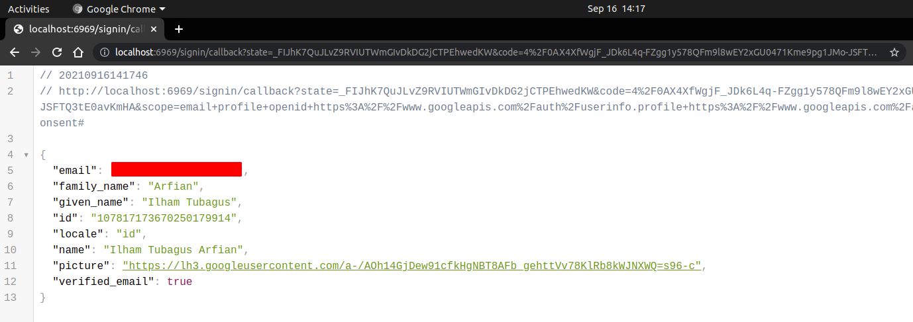

# Oauth2 Google Menggunakan Echo Golang
Repo ini mendemonstrasikan bagaimana cara mendapatkan access token untuk dapat mengakses google api seperti oauth2 api, gmail api, calendar api, dsb.

## Prerequisites
Client ID tipe web application diperlukan untuk dapat mengakses google api. Buat credential tipe web application dan **download .json** credential tersebut. 

Pastikan Origin dan redirect URI sesuai dengan endpoint yang kita definisikan pada routes aplikasi echo.

## Result
Contoh user info yang ditampilkan setelah akses token didapat dari google kemudian meminta akses ke oauth2 api untuk menampilkan profil user dari user yang terautentikasi melalui token tersebut.
